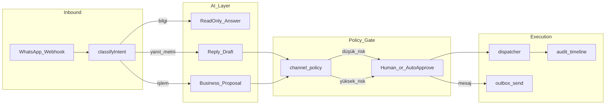

# AI + Omnichannel Mimari Hizası (Birleştirme Sonrası)

**Amaç:** `xxxhallederizcrm` birleştirmesinde UI taşınırken **yanlış mimari kurulmaması**.  
**Hedef ürün:** Yapay zeka müşterilerle konuşabilir; **izin ve kanal policy** dahilinde süreçler **otomatik (düşük risk)** veya **insan onaylı** yürütülür.

Bu belge, kullanıcı tarafından onaylanan üç kaynak özeti + sandbox kurallarını birleştirir:

1. WhatsApp + AI indeks (hibrit kural + AI + onay)
2. Proje kararları tam envanter
3. Referans görsel sayfa rehberi (76 ekran — işlev, senaryo, UI kısıtları)

**Bağlayıcı üst metinler** hâlâ PREMIUM repodaki `docs/` dosyalarıdır; sandbox’ta kopya: `docs/design/final-reference/`.

---

## 1. Doğru zihin modeli (sizin hedefiniz ≠ “AI hiçbir şey yapmaz”)

| Yanlış anlama | Doğru model |
|---------------|-------------|
| AI hiç müşteriyle konuşmaz | AI **bilgi ve taslak** üretir; **gönderim/ mutation** policy + onay + outbox zincirinden geçer |
| AI her şeyi otomatik yapar | **Hibrit:** kural + AI + fallback; düşük riskte `auto_reply_low_risk` **yalnızca kanal policy izin verirse** |
| UI’da “Gönder” = canlı mutation | Demo modda toast + disabled; canlıda **SDK + onay**; sahte başarı **yasak** |
| WhatsApp = sadece chat UI | Omnichannel: inbound webhook → sınıflandırma → öneri → onay → (Faz 4B) worker gönderim |

### Ortak 5 adım (CRM + WhatsApp + ses)

```
Bilgi sorusu     → read-only yanıt (müşteriye de olabilir)
İşlem talebi     → proposal + risk özeti
                 → approval (insan veya policy ile otomatik onay yolu)
                 → execution (dispatcher → domain → audit → outbox)
```

**Onay olmadan kritik mutation dispatch edilmez** — istisna: policy’nin açıkça izin verdiği düşük risk otomatik cevaplar (intent/kanal matrisi).

---

## 2. WhatsApp özel kurallar (birleştirmede UI’da korunacak)

### AI / operatör UI yapabilir

- Müşteri mesajına **taslak / şablon önerisi** (referans: WA operasyon paneli, gelen kutu)
- Niyet sınıflandırma sonucunu gösterme (`stok`, `fiyat`, `siparis`, …)
- Onay kuyruğuna yönlendirme; `ONAY`/`RED`/`İNCELE` komut akışı (backend foundation)

### Yapılamaz (UI veya frontend’den bypass)

- AI’nın doğrudan outbound mesaj göndermesi (live send)
- Provider yokken fake success
- Onaysız finansal/ticari write (fiyat, sipariş kesinleştirme, tahsilat, …)
- Omnichannel’da `ai` source ile direct live send

### Intent özeti (kayıtlı müşteri)

| Intent | Otomatik cevap | Satış onay | Muhasebe onay |
|--------|----------------|------------|----------------|
| stok | koşullu (miktar taahhüdü otomatik değil) | koşullu | hayır |
| fiyat | hayır | evet | hayır |
| siparis | yalnızca “talep alındı” | evet | hayır |
| odeme / fatura | hayır | hayır | evet |

---

## 3. UI birleştirme kuralları (Final referans + PREMIUM altyapı)

Birleştirme **yalnızca görünüm ve route** taşır; **iş mantığını yeniden icat etmez**.

| Konu | Kural | Referans |
|------|--------|----------|
| AI tam kolon | **Yalnızca** `/dashboard` | crm-backlog, sayfa rehberi |
| Diğer sayfalar | Sağ panel: özet/uyarı; **AI chat kolonu yok** | ui-designer-rules |
| WA panel | Liste + sohbet + bağlam; **AI taslak**; gönderim onaylı | `whatsapp-operasyon-paneli` rehberi |
| Onaylar | 3 kolon komut masası; Onayla/Reddet → backend zinciri | `onaylar-komut-masasi` |
| Hızlı İşlem | Ana operasyon; riskli iş → **approval ticket** | quick-operation-center |
| Mutation butonları | Toast + disabled-after-success; demo’da sahte kayıt yok | AGENTS.md |
| Tenant / permission | UI’dan bypass yok; session authoritative | architecture guardrails |

### Birleştirmede YAPILMAYACAKLAR

1. Referans sayfaya “Uygula”, “Otomatik Kaydet”, “Canlı Gönder” ekleyip gerçek API mutation bağlamak (onay planı olmadan)
2. `NEXT_PUBLIC_USE_DEMO_DATA=false` iken mock’a sessiz düşmek (fail-closed: boş liste, hata bandı)
3. Eski `CommandCenter` ile referans `*Page`’i aynı route’ta karıştırmak (tek kaynak: Final referans bileşeni)
4. WhatsApp UI’da gönderimi SDK bypass eden doğrudan `fetch` / fake 200
5. AI operatör ekranında proposal bypass ile `execute` çağrısı

### Birleştirmede YAPILACAKLAR (mevcut sandbox)

1. **PREMIUM** `apps/api`, `packages/domain`, approval, webhook, `data-source.ts` **korunur**
2. Final `*Page.tsx` + `*-reference.css` route’a bağlanır
3. P0 listeler: `useReferenceData` — demo mock / canlı SDK **ayrımı**
4. WA/AI ekranları: görsel referans + mevcut PREMIUM proposal/onay bileşenleri yan yana kalabilir; canlı bağlantı **ayrı faz**

---

## 4. Sizin AI entegrasyonu için uygulama sırası (merge sonrası)



| Faz | İş | Sahip katman |
|-----|-----|----------------|
| A | UI referans tamam (sandbox) | Merge ✅ |
| B | Inbound webhook + intent + duplicate guard | API/domain (PREMIUM) |
| C | `ai_reply_suggestions` → onay masası | API + web onaylar |
| D | Policy `auto_reply_low_risk` + outbox send worker | worker |
| E | Operatör panel: taslak düzenle → onayla → gönder | web + API |

**Birleştirme fazı A’dadır.** B–E için UI hazır; backend fazları PREMIUM-CURSOR planına göre ilerler — UI’da sahte “canlı” davranış eklenmez.

---

## 5. Sayfa rehberi ile route eşlemesi (kritik P0)

| Rehber PNG | Sandbox route | AI notu |
|------------|---------------|---------|
| dashboard-operasyon | `/dashboard` | Tam AI kolon; mutation CTA yok |
| whatsapp-operasyon | `/whatsapp` | Taslak + onaylı gönderim |
| onaylar-komut-masasi | `/onaylar` | İnsan onay merkezi |
| ai-operator-hub | `/ai/operator-hub` | Plan inceleme; execute yok |
| ai-icgoruler | `/ai/icgoruler` | Read-only içgörü |
| hizli-islem-satis-masasi | `/hizli-islem` | Onaya gönder; doğrudan kesinleştirme yok |
| gelen-kutu-uc-panel | `/gelen-kutu` | 3 panel; şablon mesaj |

Statik `/cariler/detay` ile `/cariler/[customerId]` paralel — entity katmanları dynamic route’a taşınırken **onay zinciri değişmez**.

---

## 6. Sandbox doğrulama checklist (Tech Lead)

- [ ] `pnpm typecheck` + `turbo run typecheck --force`
- [ ] `pnpm smoke:product-readiness`
- [ ] WA/AI sayfalarında “canlı gönderildi” demo toast’ları `data-source` ile uyumlu
- [ ] `AIAssistantPage` confirm/reject → mevcut approval API (mock/canlı)
- [ ] Yeni kod: AI doğrudan `sdk.*.create` çağırmaz (adapter’lar read + proposal only)
- [ ] `docs/MERGE_STATUS.md` “mock-only” satırları güncel

---

## 7. Özet (Tek cümle)

**Birleştirme = Final görünüm + PREMIUM güvenlik/onay omurgası; AI müşteriyle konuşur ve süreç yürütür, ancak her zaman `policy → (onay | otomatik düşük risk) → dispatcher → audit → outbox` zincirinden geçer — UI bu zinciri kısaltmaz.**
