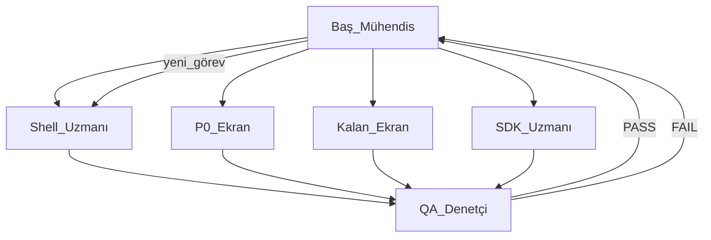

# Birleştirme Takım Komuta Yapısı

**Baş Yazılım Mühendisi (Tech Lead):** Ana agent — görev dağıtımı, entegrasyon, blocker çözümü, QA onayı sonrası sıradaki iş.

**Sandbox:** `xxxhallederizcrm`  
**Kaynaklar (read-only):** `HallederizCRM-PREMIUM-CURSOR`, `hallederizcrm final`

## Takımlar ve roller

| Rol | Sorumluluk | Rapor |
|-----|------------|-------|
| **Tech Lead** | Koordinasyon, `MERGE_STATUS.md`, çakışma çözümü, QA gate | `docs/MERGE_STATUS.md` |
| **UI Shell Uzmanı** | AppShell, login, sistem state, `reference-globals.css` | `docs/team-reports/shell-specialist.md` |
| **P0 Ekran Uzmanı** | dashboard, hizli-islem, onaylar, cariler, teklifler, siparisler, tahsilatlar, belgeler, whatsapp | `docs/team-reports/p0-screens-specialist.md` |
| **Kalan Ekran Uzmanı** | katman, fabrika, ERP, gelen-kutu, AI, raporlar, archive, stok, depo… | `docs/team-reports/remaining-screens-specialist.md` |
| **SDK Entegrasyon Uzmanı** | `useReferenceData`, P0 mock↔SDK adapter | `docs/team-reports/data-integration-specialist.md` |
| **Kalite Kontrol (QA)** | typecheck, smoke, route audit — **uygulama yapmaz**, doğrular | `docs/team-reports/qa-controller-report.md` |

## İş akışı

1. Tech Lead görev atar (kapsam + dosya sınırı).
2. Uzman uygular, `docs/team-reports/<rol>.md` yazar.
3. QA komutları çalıştırır, PASS/FAIL raporlar.
4. Tech Lead QA PASS görmeden “bitti” saymaz; FAIL → aynı uzmana veya blocker için kendisi düzeltir.

## Kapsam kuralları

- Uzmanlar **yalnızca** kendi modül/dosyalarına dokunur.
- Orijinal PREMIUM ve Final klasörleri **değiştirilmez**.
- Plan dosyası (`.cursor/plans/`) düzenlenmez.
- Commit yalnızca kullanıcı isteğiyle.

## Backlog (Tech Lead sıra)

| Öncelik | Görev | Atanan |
|---------|-------|--------|
| P1 | Liste→detay `?orderId` / `?offerId` / `?paymentId` | SDK Uzmanı (aktif) |
| P1 | Tahsilatlar detay adapter | SDK Uzmanı (aktif) |
| P1 | Teslimatlar + fatura + iade operasyon | Kalan Ekran (aktif) |
| P1 | QA: typecheck + smoke:navigation + smoke:product-readiness | QA (aktif) |
| ✅ | Cariler detay/katman, sipariş/teklif detay, gelen kutu, hızlı işlem preview | Tamamlandı |
| P3 | Eski CommandCenter temizliği | Tech Lead onayı sonrası |

Durum: [`MERGE_STATUS.md`](./MERGE_STATUS.md)
