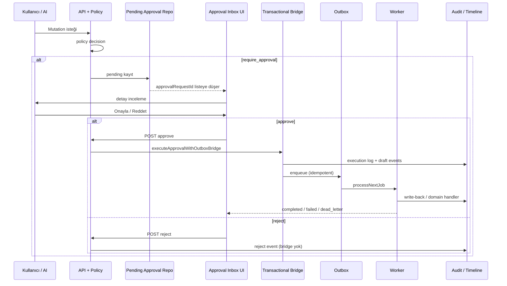
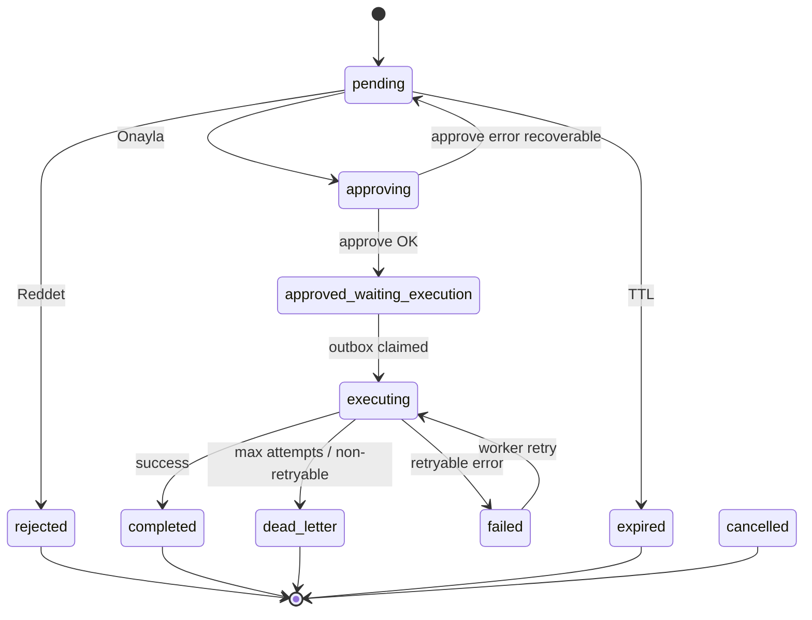

# Approval Inbox — UI Akışı ve Durum Makinesi

## Route önerileri

Uygulama menüsünde kanonik Türkçe route `/onaylar` ile uyumlu kalınır; API ve ürün dili `approvalRequestId` kullanır. Önerilen web route’lar:

| Route | Amaç |
|-------|------|
| `/approvals` | Inbox ana liste; varsayılan pending odaklı |
| `/approvals?status=pending` | Paylaşılabilir derin filtre (bekleyenler) |
| `/approvals/[approvalRequestId]` | Tek kayıt detayı; liste + seçili panel veya tam sayfa detay |

**Not:** Mevcut modül haritası legacy alias olarak `/approvals` kaydeder; yeni implementasyonda shell, arama placeholder ve sidebar **Onaylar** etiketi `/onaylar` ile hizalanmalı, query parametreleri aynı kalabilir.

**Platform API (backend foundation):**

- `GET /platform/approvals`
- `GET /platform/approvals/:approvalRequestId`
- `POST /platform/approvals/:approvalRequestId/approve`
- `POST /platform/approvals/:approvalRequestId/reject`
- `GET /worker/health`
- `GET /worker/safety`

Web alias route'lar `/approvals` ve `/dashboard/approvals` kanonik `/onaylar` sayfasina yonlendirilir.

---

## Kullanıcı akışları

### Pending approval görüntüleme

1. Kullanıcı Onaylar menüsüne girer.
2. Liste `status=pending` (veya birleşik “aktif” kümesi) yüklenir.
3. İlk kayıt seçilir; sağ panel özet + risk + AI açıklama iskeleti dolar.
4. KPI şeridi (opsiyonel): bekleyen sayı, yüksek risk sayısı, bugün onaylanan.

### Detay inceleme

1. Satıra tıklama veya `/approvals/[approvalRequestId]` deep link.
2. Detay: `reasons`, entity önizleme, audit/timeline preview, outbox/execution göstergesi.
3. Viewer rolünde CTA yok; approver’da karar çubuğu aktif.

### Approve

1. Kullanıcı **Onayla** (yüksek riskte onay diyaloğu).
2. UI `approving` → API `POST .../approve`.
3. Başarı: durum `approved_waiting_execution` veya doğrudan `executing` (senkron bridge yanıtına göre).
4. Bridge metadata: execution log, audit/timeline draft, outbox enqueue bayrakları gösterilir.
5. Toast + CTA disabled; polling veya push ile execution tamamlanması izlenir.

### Reject

1. Kullanıcı **Reddet** (isteğe bağlı gerekçe).
2. UI `rejecting` → API `POST .../reject`.
3. Execution bridge **tetiklenmez**; durum `rejected`.
4. Audit’te red kaydı; liste filtrelerine göre kayıt pending listesinden düşer.

### Duplicate approve

1. Kullanıcı veya kanal tekrar onay gönderir.
2. API idempotent: `already_processed` / conflict gövdesi.
3. UI: duplicate/idempotency bandı; mevcut `executionId` / son durum; ikinci outbox job yok.

### Rejected item re-open denemesi

1. Kullanıcı reddedilmiş kayıtta Onayla dener.
2. Fail-closed: CTA disabled veya API hata; “Yeniden açma inbox’tan yapılmaz — kaynak işlemden yeni talep” mesajı.
3. İlgili entity veya AI proposal ekranına yönlendirme linki.

### Worker / outbox pending state

1. Onay sonrası `outboxJobId` atanır, job `pending`.
2. UI: “İcra kuyruğunda” rozeti; tahmini işlem süresi metni (SLA yoksa nötr).
3. Worker claim öncesi kullanıcı listeyi yenileyebilir; durum korunur.

### Execution failed state

1. Dispatcher veya handler `failed`; mesajda `[RETRYABLE]` veya `[NON_RETRYABLE]`.
2. UI: `failed` rozeti; yeniden deneme varsa sonraki deneme zamanı.
3. Approver’a “karar verildi, icra tamamlanamadı” ayrımı net gösterilir.

### DLQ state

1. Max attempt veya non-retryable → `dead_letter`.
2. UI: `dead_letter` durumu; operasyon ekibine eskalasyon metni; `outboxJobId` / `executionId` kopyalanabilir referans.
3. Replay bu doküman kapsamında admin aracına bırakılır; inbox read-only gösterir.

---

## Step-by-step: policy’den tamamlanmaya

**Adımlar (metin):**

1. **Policy `require_approval`:** Mutation bloklanır; yanıtta `approvalRequestId` ve metadata.
2. **Pending approval yaratılır:** Repository (`pending_approval_requests`) veya foundation in-memory; `status=pending`.
3. **Inbox listesine düşer:** `GET /platform/approvals` tenant + permission guard.
4. **Kullanıcı detay açar:** `GET /platform/approvals/:id` + audit/timeline/outbox read model (ileri faz).
5. **Onayla / Reddet:** Guard zinciri; red’de bridge yok.
6. **Approve → transactional bridge:** Dispatch, persistence, outbox enqueue tek sözleşme; kısmi başarı success sayılmaz.
7. **Outbox job:** `approval.execution.dispatch`, `audit.timeline.writeback`, vb. handler anahtarları.
8. **Worker işler:** Retry/backoff veya DLQ; duplicate idempotency ikinci iş üretmez.
9. **Audit / timeline güncellenir:** Entity timeline ve onay execution izi operatör tarafından görülebilir.

---

## UI state machine

UI durumları backend `status`, execution ve outbox alt durumlarının **birleşik görünümüdür**. Geçişler fail-closed ve idempotent API ile uyumludur.

| UI state | Anlam | Tipik tetikleyici | Kullanıcı aksiyonları |
|----------|--------|-------------------|------------------------|
| `pending` | Onay bekliyor | Policy `require_approval` | Onayla, Reddet, incele |
| `approving` | Karar gönderiliyor | POST approve in-flight | CTA kilitli |
| `approved_waiting_execution` | Onaylandı, icra henüz başlamadı veya kuyrukta | Approve OK, outbox pending | Bekle, yenile |
| `executing` | Dispatcher / worker işliyor | Job `processing` | Bekle, yenile |
| `completed` | Execution başarılı | `executed` + write-back tamam | İlgili kayda git |
| `failed` | Execution veya kalıcı yazım hatası | Handler/repository hata | Destek referansı, retry bilgisi |
| `dead_letter` | Retry tükendi veya non-retryable | `moveJobToDeadLetter` | Eskalasyon, read-only |
| `rejected` | İnsan reddi | POST reject | Yeni talep kaynak akıştan |
| `expired` | Süre/policy dolumu | TTL veya policy | CTA kapalı |
| `cancelled` | Üst kayıt veya süreç iptali | Supersede / cancel execution | Bilgilendirme |

**Geçiş kuralları (özet):**

- `pending` → `approving` → `approved_waiting_execution` | `rejected` | `expired`.
- `approved_waiting_execution` → `executing` → `completed` | `failed` | `dead_letter`.
- `failed` + retryable outbox → tekrar `executing` (UI aynı kartta güncellenir).
- Duplicate approve: durum değişmez; UI bilgi bandı.
- `rejected` / `expired` / `cancelled` → `pending` **inbox üzerinden olmaz**.

---

## İlgili dokümanlar

- [APPROVAL_INBOX_PRODUCT_SPEC.md](./APPROVAL_INBOX_PRODUCT_SPEC.md)
- [APPROVAL_INBOX_COMPONENT_MAP.md](./APPROVAL_INBOX_COMPONENT_MAP.md)
- [approval-execution-flow.md](../approval-execution-flow.md)

## 2026-05-13 — Approval Inbox UI foundation

- Liste/detay/approve/reject akisi `ApprovalInboxShell` uzerinden API client ile calisir.
- 401/403/503 ve bos durumlar ayri UI state olarak gosterilir.
- Worker health ve production safety badge'leri read-only foundation metadata kullanir.

## 2026-05-13 — Navigation and inbox polish

- `/approvals` ve `/dashboard/approvals` alias redirect'leri `/onaylar`a yonlenir.
- Dashboard ve AI panelinden Onaylar hizli erisimi eklendi.
- Filtre/search/sort ve hata mesajlari UI helper katmaninda toplandi.
