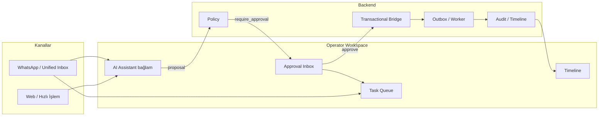

# Operator Workspace — Ürün Spesifikasyonu

## Operator workspace nedir?

Operator Workspace, iç personelin **günlük operasyon cockpit’i**dir: müşteri mesajları, AI önerileri, onay bekleyen işlemler, görev kuyruğu ve entity timeline’ı tek çatı altında birleştirir. Amaç, modüller arası sekme kaosunu azaltıp **bağlamlı karar** (ne yapılacak, kim onaylayacak, icra edildi mi) akışını sürdürülebilir kılmaktır.

Workspace **mutation yapmaz**; onay ve icra backend zincirinden geçer ([approval-execution-flow.md](../approval-execution-flow.md)). AI read-only veya proposal üretir ([ai-operator-mode.md](../ai-operator-mode.md)).

Bu doküman gelecek UI implementasyonu için referanstır; kod bu fazda üretilmez. Üretim rota ağacı ve shell durumları için bkz. [PRODUCTION_ROUTE_MANIFEST.md](./PRODUCTION_ROUTE_MANIFEST.md).

---

## Bileşenler arası ilişki

| Yüzey | Rol |
|-------|-----|
| **Approval Inbox** | İnsan onayı gereken `actionKey` kayıtları; karar ve icra durumu |
| **AI Assistant** | Özet, risk, taslak proposal; Dashboard’da tam kolon, workspace’te bağlam paneli |
| **Unified Inbox** | Omnichannel konuşmalar; onay komutları ve müşteri bağlamı |
| **Timeline** | Entity ve onay execution olayları; denetim ve takip |
| **Task Queue** | Onay sonrası follow-up, depo, tahsilat, geri arama görevleri |

---

## Ana layout

| Bölüm | İçerik |
|-------|--------|
| **Sol navigasyon** | Mevcut CRM sidebar: Gösterge Paneli, Hızlı İşlem, Onaylar, WhatsApp, Cariler, Stok, Arşiv, Raporlar, Ayarlar — workspace ayrı menü maddesi değil, **modüllerin birleşik kullanım modeli** |
| **Orta iş listesi** | Bağlama göre: onay listesi, görev listesi, konuşma listesi veya hızlı işlem kuyruğu; kompakt satır, satır seçimi |
| **Sağ bağlam / AI paneli** | Seçili kayıt özeti, AI açıklama, audit kısa önizleme, hızlı linkler (ilgili cari, sipariş); Dashboard dışında tam video-hero AI kolonu açılmaz |

Dış ölçü: `max-width: 1604px`, dikey taşma kontrollü; liste gövdesi iç scroll ile en az 5 satır ilk görünüm hedefi.

---

## Operatörün günlük akışları

### Gelen müşteri mesajı

1. Unified Inbox’ta konuşma seçilir; cari ve açık sipariş bağlamı sağ panelde.
2. Gerekirse Hızlı İşlem veya modül deep link.
3. Timeline’da son iletişim ve belge olayları.

### AI önerisi

1. Operatör AI’ya soru veya özet ister (read-only).
2. Mutation niyeti → proposal; inbox veya `/ai/onaylar` hattına düşer.
3. AI doğrudan onaylamaz; approver kararı beklenir.

### Approval gereken işlem

1. Policy `require_approval` → kayıt Approval Inbox’ta.
2. Manager/approver risk, gerekçe ve önizlemeyi inceler.
3. Onayla / Reddet; operatör çoğunlukla izler ve müşteriye bilgi verir.

### Onay sonrası execution

1. Transactional bridge + outbox; worker handler.
2. Workspace’te outbox/execution göstergesi güncellenir.
3. Başarısızlıkta görev veya eskalasyon maddesi Task Queue’ya düşer (ürün kuralı).

### Follow-up / task creation

1. `completed` sonrası şablon görev: müşteri bilgilendir, belge gönder, depo hazırlık.
2. Görev entity timeline’a bağlanır.
3. WhatsApp üzerinden belge gönderimi ayrı onay gerektirebilir (`send_document_whatsapp`).

---

## CRM modülleriyle ilişki

| Modül | Workspace bağlantısı |
|-------|----------------------|
| **Cari** | Inbox ve inbox konuşmalarında müşteri bağlamı; risk ve limit uyarıları |
| **Teklif** | `create_offer` onayları; AI taslak proposal |
| **Sipariş** | `create_order`, `update_order_status`; onay sonrası fabrika/ERP outbox |
| **Tahsilat** | `create_payment`; yüksek risk onay şeridi |
| **Stok** | Stok düşümü / rezervasyon onayları; düşük stok uyarıları görevle |
| **Depo** | `mark_warehouse_ready`; depo görev kuyruğu |
| **Teslimat** | `complete_delivery`; saha operatörü task + onay |

Her modül kaydı entity timeline üzerinden workspace sağ paneline **read-only** özet sağlar.

---

## Approval Inbox bu workspace içinde

- Onaylar menüsü (`/onaylar`, ürün dili `/approvals`) orta kolonun **onay modu**dur.
- Seçili onay sağ panelde AI açıklama + audit önizleme ile senkron.
- Gösterge Paneli KPI’ları onay sayısına link verir; tam AI kolonu yalnızca dashboard ana sayfada kalır (UI kuralları).

---

## Güvenlik ve tenant

- Tüm liste/detay tenant scope’lu; mismatch ve permission denied inbox ile aynı Security UX ([APPROVAL_INBOX_PRODUCT_SPEC.md](./APPROVAL_INBOX_PRODUCT_SPEC.md)).
- Viewer rolü workspace’te görev atayamaz; approver onayı olmadan mutation CTA yok.

---

## Gelecek implementasyon notları

- Tek “Operator Workspace” route zorunlu değil; **davranış standardı** modüller arası tutarlılıktır.
- Backend: `GET /platform/approvals`, worker outbox read, audit/timeline API’leri workspace veri katmanını besler.
- DLQ replay ve kanal `ONAY`/`RED` komutları ayrı faz.

**İlgili dokümanlar:** [APPROVAL_INBOX_PRODUCT_SPEC.md](./APPROVAL_INBOX_PRODUCT_SPEC.md), [APPROVAL_INBOX_UI_FLOW.md](./APPROVAL_INBOX_UI_FLOW.md), [APPROVAL_INBOX_COMPONENT_MAP.md](./APPROVAL_INBOX_COMPONENT_MAP.md), [quick-operation-center.md](./quick-operation-center.md).
